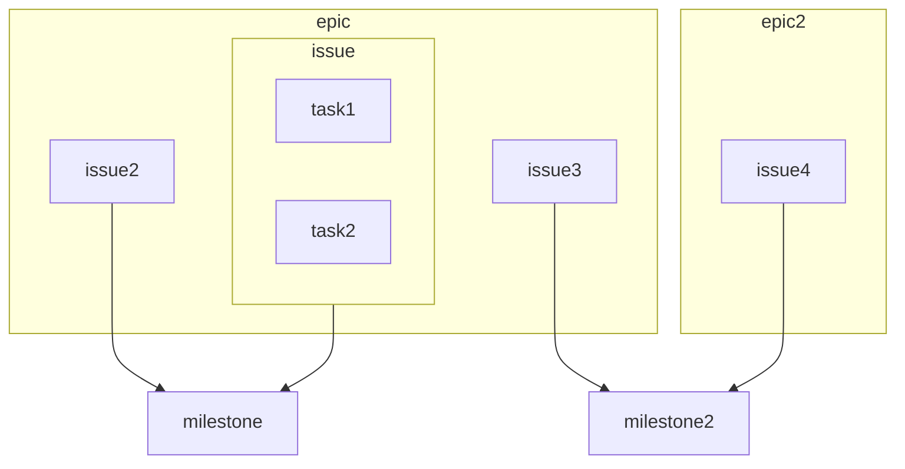

## 計画
- 今の使い方ってどうなの？ Atlassian編
- 今の使い方ってどうなの？ GitLab編
- 
- 既存プロジェクトの運用を移動する
- 非エンジニア
## テンプレートの移植
- issue テンプレート
- epicテンプレート
- wiki の移植
- ラベルの定義作成
- プロジェクトの権限整理
- 非エンジニア向けスペースの設定
- 運用ルール
- プロジェクトの計画まわり
- エピックボード/プロジェクト/全体

## ラベル周りを整理
- Epicで使うもの
- issueで使うもの
- MRで使うもの
- 運用保守で使うもの
- 開発で使うもの
- 優先順位

## テンプレートの新規作成

## マイルストーン
Epic と同時もしくは前に作ると良い

- `epic`は `milestone2`の`issu3` が完了しないとクローズできません。
### 理由
1. issueがつけられる
2. マージリクエストがつけラエル
3. リリースがつけられる

:::warning
後回しにすると大変
:::
### マイルストーンはグループにする
プロジェクトにもつけられるが、基本チーム管理なので、プロジェクト毎に

### テンプレート
- マイルストーンテンプレートの登録はできない？
- CLI?
- CI?

### クローズ
