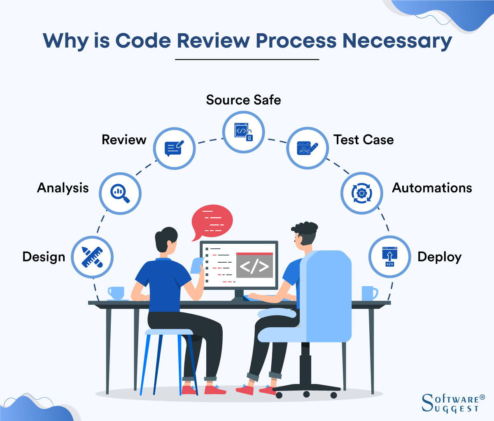

## この文書の目的
色々なところでコードレビュについて語られていますが、自分の考えを整理する意味で、ここに残します。
主観的なことも混じっていますので、客観性がない部分もありますが、そこはご了承ください。

## コードレビュの目的
Linter/ Formatter/テストを書いてCIで自動化するのが当たり前になってきた時代でなんで人間がレビュする必要があるのか？
って思いますが、 一般的に下記が主な目的って考えるとレビュはまだまだ必要だなって思います。



> 1. It minimizes your chances of having critical issues.
> 2. It improves and increases the new code efficiencies.
> 3. It makes sure there are no disturbances in the code.
> 4. It ensures that the new code adheres to the guidelines.
> 5. It improves team members’ expertise

参考：[Why is Code Review Necessary?](https://www.softwaresuggest.com/blog/free-open-source-code-review-tools/#)

1. 重要な問題が発生する可能性を最小限に抑えます。
2. 新しいコードの効率が向上し、向上します。
3. コードに障害がないことを確認します。
4. 新しいコードがガイドラインに準拠していることを保証します。
5. チームメンバーの専門知識を向上させます。

特に個人的には4,5 の目的は大変大きく。私がジョインしたチームは大体若い方が多いので、メンバーに案件知識の醸成とエンジニアスキルの教育目的でレビュすることが多いです。

レビュ頻度は細かければ良く。個人的には1日に１回ぐらいチームメンバーとレビュできるとフィードバックも早くて良いと思います。
ただ、リードが常にやるスタイルだと大変なので（やったこともありますが・・・）

1. デイリーのピアレビュ
2. スプリント終了時のリードが見るウォークスルーレビュ

って感じだと案外安定するのかなって思います。リードはその時間ぐらいは確保させたいです。

## レビュに向けて整備しておいたほうが良いもの

下記は必ず整備したほうがいいです。ないと大変です。

### 設計書・コーディングガイドライン
お固い現場だと設計書がない現場ってあるんですか？って思う方いますが、スタートアップとか、Web、ゲーム、アプリ系は案外ドキュメントがないことが多いです。
日々変わる内容を反映していられないよって思っている人が多い印象です。  
無くても小規模だと回るんですが
この辺りが整備されていないと、レビュ指標がないので、バラバラになりがちです。仕様を明文化するのが難しければ、お作法なりはまとめるだけでもだいぶマシになります。公開されているものを参考にするのも良いです。

まずはGoogle のスタイルガイドとか導入するのがおすすめです。  
[Google Style Guide](https://github.com/google/styleguide)

### レビュツール
GitHubからGitLabなど、レビュイーが目的持ってPR/MR 出して、レビュワーがそれに指摘を出す。
無料から使えるのでしっかり使うと良いです。
またレビュを残すと後々、過去に不具合を入れ込んだ時のレビュ状況なども追えるので振り返りがしやすいです。

バージョン管理ツールを使っていない現場も稀にありますが、バージョン管理がわからなくても入れておくだけで差分チェックできるので良いはずです。


### CIツール
人力レビュは **非常に辛い**ので、人間の作業量を減らす意味でも静的解析での指摘などツール化して自動化しましょう。
最初はビルドテスト、Lintテストぐらいで良いと思います。
余裕が出てくれば、Unitテスト、APIテスト、E2Eテストなど整備していくのが良いと思います。

GitHub Actions とか GitLab CI とか無料枠でもそこそこ使えます。

## レビュで守って欲しいこと
レビュは基本、感覚的なところが多く、レビュワーの知識任せになりますので、レビュ品質は数をこなすしかないと思っています。

とはいえ指標がないと困ると思うので、下記を最低限守って欲しいです。

### レビュワ
#### 1. 仕様とガイドラインは頭に入れてからレビュに臨む
何も準備しないでコードを眺めている人が良くいますが、それだとCompilerとかLinterと変わらないので、仕様とかガイドラインは把握しましょう。
ピアレビュの場合、自分の担当範囲じゃありませんし、ドキュメントがない現場だと仕様がわからないとかあって困ると思いますので、仕様をヒアリングするかPR/MRのDescriptionに書いてもらいましょう

#### 2. レビュをするときはしっかり時間をとる
時間をとってレビュしてください。時間がない中で捌く形で処理してしまうとしっかりしたレビュができません。

#### 3. フィードバックは3回まで
レビュイーの心が折れるので、3回までと区切って指摘しましょう。特に重箱の隅を突くようなレビュをする人はやめましょう。
3回以上フィードバックするということは何か理解が進んでいないか、ツールが整備されていない、レビュイーの能力を超えていることが多いです。
別タスクで対応する方向を検討しましょう。

#### 4. 根拠のある指摘をする
特にここ間違えると`いじめ`か`喧嘩`になるのでしっかりと指摘理由がわかる内容にしてください。
```text
ここは。〜〜のアルゴリズムを採用してまとめると保守性が高まりますので〜〜を採用してください。
```

#### 5. 図なりも活用してわかりやすい指摘をする
最近のドキュメンテーションツールは下記に対応しているのでしっかり使えるようになりましょう
- [Mermaid](https://mermaid.js.org/)
- [PlantUML](https://plantuml.com/ja/)

#### 6. 思想・慣習・常識・宗教は持ち出さない
カッコの付け方など完全に好みの話になるのと、`Linter/Formatter` など機械で対応すれば良いものを人間で対応しなくていいです。
Projectに入れていないなら入れましょう。  
また、`こういう思想なので〜`みたいな指摘も`NG`です。 それでヘイト上がった現場をよく見ています。
思想があるならコーディングガイドラインなどでそうすべき理由をしっかり伝え、ガイドライン違反であることを指摘してください。
好みの話をレビューに持ち込まないように気をつけましょう。

#### 7. 細かいテストはしない  
レビュで細かいテストはしなくて良いです。勘違いなどもあるので仕様通りできているかなどの把握する意味で軽い動作確認は問題ないですが、
細かいテストをするほどレビュワーは暇じゃないはずですし、タスク単位で動作確認するぐらいならスプリント単位でマージされたものを動作確認したほうが効率的です。

#### 8. レビューを通したから動くものが出来上がっているわけではない
テストじゃないので、動かないコードが上がっている可能性があります。CIツールで動くコードのテスト環境を整備してそちらでテストしましょう。

#### 9. 良いところ/参考になったところは褒める
単純にレビュイーのモチベーションが上がります。

#### 10. 公序良俗に反することは書かない  
たまに罵倒し合う人がいます。綺麗な言葉を使いましょう。

### レビュイ
#### 1. 仕様とガイドラインは準備してからレビュに臨む
何も準備しないでレビュを上げる人がいますが、忙しいレビュワのヒアリングコストが跳ね上がりますので、しっかり準備しましょう。

#### 2. テストエビデンスは添える
動作確認をしていない。Linterでチェックしていない。Unitテストしていないなど。テストしないでレビュに上げる人がいますが、レビュワはテスターじゃないので、最低限テストしていることを確認できる内容を添えましょう。
これがあるとレビュワーも安心してレビュに臨めます。
逆にエビデンスがないと、`本当にテストしたのか？動くのか？`と不信感に苛まれ、レビュ指摘が厳しくなります。私は厳しくなっちゃいます。

#### 3. 指摘事項でいちいち凹まない
時々、指摘事項を読んでげんなりする人がいますが、 建設的な意見がある前提であれば、自分のステップアップだと思って受け入れてください。

#### 4. レビュ指摘の対応に時間をかけない
feature ブランチのマージが遅ければ遅いほど、マージする時のコンフリクトリスクが高くなります。コンフリクト解消でバグが入り込むことは多いのでささっと直しましょう。

#### 5. レビュがなかなかされない場合は催促する
忙しくてレビュを放置されているケースがありますので、催促しましょう

#### 6. レビュされないからってイライラしない
忙しくてレビュを放置されていますが、別のタスクをして待っていましょう。

#### 7. 公序良俗に反することは書かない
たまに罵倒し合う人がいます。綺麗な言葉を使いましょう。


## まとめ
コードレビュをしっかりする文化を設けるとプロジェクトの品質が安定しますので、しっかり取り組んで欲しいです。
