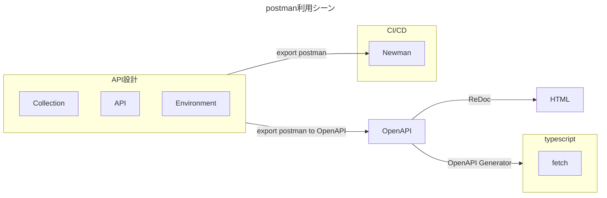

# Postman Tokyo Meetup 2023.10
  
Postman Tokyo Meetup 2023.10 に参加しました。学びが多かったので感じたことをまとめます。
> 画像はconnpassより引用

[イベントページ](https://postman.connpass.com/event/294381/)

## Postmanの理解
私は業務でPostmanを使うことが多いのですが、主に下記の用途で使うことが多いです。
OpenAPI Generator と併用することが多いので、Collectionはしっかり作るようにしているのと
Newman でAPIをCIやCLIで実行するのに利用したりしています。かれこれ5年以上使っていますが、最近のアップデートが目まぐるしく使いこなせないので、今回のイベントに参加しました。

## イントロダクション
機材トラブルで駆け足になったので、掻い摘むと
1. postnauts(ポストノーツ)
2. 2023年11月15日に日本語翻訳されたベータ版リリース  
アーリーアクセスの募集をしているみたい(執筆段階では応募方法応募方法わからず)
3. 2023年12月5日 15時 グランドハイアット東京で日本オフィス開設イベント(詳細は今後)
4. 日本法人は４名で回している

:::message
ここから本題
:::

## セッション： 徹底解説！PostmanでAPIパフォーマンステスト
@[tweet](https://twitter.com/xiombatsg/status/1711674756507029905)

### パフォーマンステスト概要
#### パフォーマンステストってなんでやるのか？
パフォーマンステストは
> Testing shows the presence, not the absence of bug.
>
> テストによってバグの存在が明らかになる
つまり、網羅性のある質の高いテスト戦略が品質保証の鍵になる

### 要約
1. パフォーマンステストは開発の早い段階から入れていこう
2. Postman 日本オフィスt

## セッション：分散トレーシングとウェブアプリケーションのパフォーマンス
@[tweet](https://twitter.com/xiombatsg/status/1711682579978682431)
## セッション：ぼくのかんがえたさいきょうのPostmanかんきょう
@[tweet](https://twitter.com/xiombatsg/status/1711693787163185434)
## セッション：Notion SupportのPostman利用法
@[tweet](https://twitter.com/xiombatsg/status/1711699273862259024)
