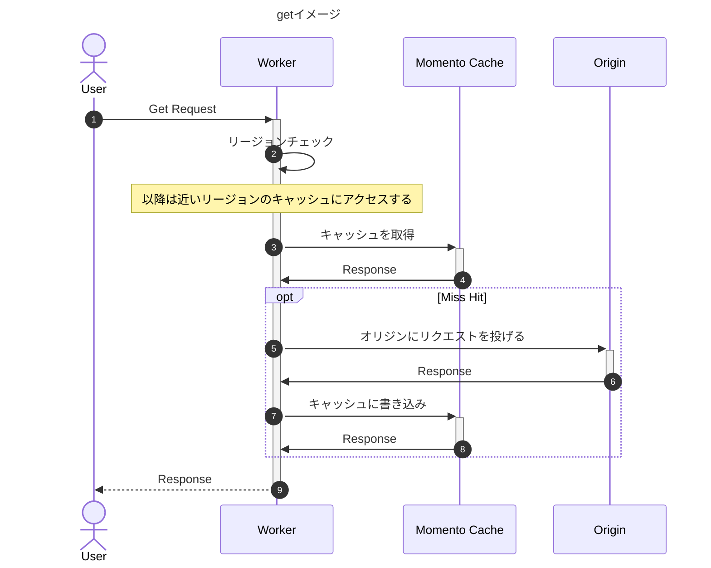
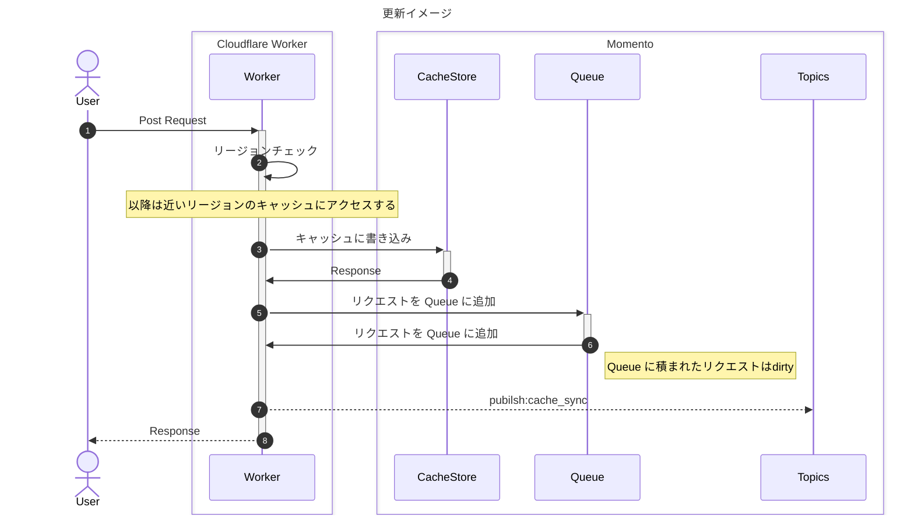
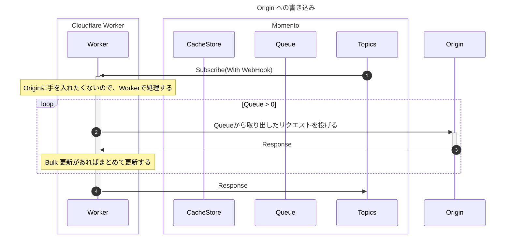

# Cloudflare Worker + momento でリージョンと戦う

:::message
この記事は、Cloudflare Advent Calendar 2023 17日目の記事です。
:::

@[card](https://qiita.com/advent-calendar/2023/cloudflare)

## お詫び
:::message alert
記事中にPost の件なども触れているのですが、そちらはプログラムをもう少し作る必要があるため、実装後別で記事にします。
:::


## 今回の記事のプログラム
@[card](https://gitlab.com/future-techno-developers/public/cloudflare-worker-collection/momento-cache-worker)

## LT資料
Cloudflare Meetup Tokyo vol.3 でLTした内容です。
@[speakerdeck](76c33fe7d1ea4ffea1a20ea2e8c721ef)

## 後半に出る Postman Monitorも見れるように用意してます。

### Postman Monitor
@[card](https://www.postman.com/ftechno-dev/workspace/presentation/monitor/Cloudflare-Worker-x-Momento----~1eea0a30-4039-40c0-83ea-65b3b62cb343)

:::message
workspace にCollection などもありますが、originサーバーは諸事情により、基本落としています。
:::


## はじめに
Cloudflare Worker の最大の特徴であるフリーリージョン。今回はこれにフォーカスして書きます。
### フリーリージョンとは？
@[card](https://www.cloudflare.com/ja-jp/network/)
CloudflareはVPCやリージョンがなく、世界中のデータセンターで同じサービスが動いている。

#### 特に
Cloudflare Worker に入ってくるリクエストは 一番近いデータセンターで処理されるため、どこからでも同じ速度でアクセスできるのは魅力です。

### とはいえ
全部、Cloudflare Workerにするわけにもいかないケースもあると思います。そうなると考慮が必要になるのが、オリジンサーバーのリージョン。
Cloudflare Worker を通じて、オリジンへのアクセスがあるとどうしてもリージョンを意識しなくてはならず、Cloudflare のメリットを享受できません。

:::message
Smart Routing を使うなどでも部分的に対応できると思いますが、お金がそれなりにかかるのと、ケースによっては効果がそれほどない
:::

### 各リージョンにオリジンをおけばいいんじゃないの？
実際はその方が良いんですが、オリジンを**ワールドワイドに配置するのはとにかくコストがかかります**。

特にAWSをよく使うのですが、
システム構成１セット増やすだけでお金かかるのは避けたいです。 特にワールドワイドであれば、結構な数配置することになり、 どれだけお金かかってもよくて、サービスを最速にするのであれば、 各国に配置して、MultiRegion で、データ管理すれば良いと思います。

ただこれはやはりハードルが高いです。

:::message
とにかくAWSは高いので、増やしたくない。
:::

### そこまで気にすることなの？海外でしょ？
国内向けのWebサービスだとそれほど必要ないのですが、海外を視野に入れた場合に考慮は必要だと思います。
特に私が関わるサービスだとメインターゲットは国内市場ですが、海外からのユーザーの数もそこそこあるため、体験をなるべく良くしていきたいです。
ただ、マルチリージョンにするほどの予算はないため、コストとの戦いになります。

### CDN でキャッシュしたら？
それも考えたんですが、CMSを使うような単純な読み物系サイトであれば静的にファイルを配置するなど考えられますが、Write　が伴う場合は難しいです。
アプリだと Writer > Reader になりやすい(Readはフロントでキャッシュしていたりもする)ので

## で、結局どうしたいの？
ここから本題です。一つのアイデアですが、下記の方式である程度なんとかならないかなと思っています。

:::message
実際のサービスに使用しているわけじゃありませんが、使っていきたいとは思っています。
:::

1. Cloudflare Worker と オリジンの間にMomento Cache を 全リージョンにおく
2. Cloudflare Worker でリクエスト元の Country 情報を見て、一番近い Momento Cache にアクセス
3. Getリクエスト はCashe Aside パターンでキャッシュを取得して、レスポンスにして返す
4. 更新系のリクエストはWrite Through パターンでキャッシュに書き込む。この時オリジンとの同期が取れるまでキャッシュがdirty になる
5. 更新されたキャッシュを非同期で、オリジンに送り、永続化する
6. ユーザーはリージョン感をまたがない

:::message
リージョン間のキャッシュの同期は別記事で掲載予定です。
:::

## 処理の流れ
### 取得

### 更新
:::message
前提として、リクエストパラメータで更新情報が確定するものを想定。
Origin側で計算して算出するような内容は今回は考慮していません。（別途記事にします）
:::

### 更新（オリジンへ書き込み）

:::message
オリジン書き込み後のGet リクエストとの整合性が考慮できておらずうまくできていないため実現できていないです
:::

## 処理概要
### リージョンチェック
Cloudflare のRequest Header にCloudflare のcf情報が追加されており、どこのデータセンターにリクエストが到達したのかなど情報が入っています。
`cf.country`フィールドを使用して、各国のデータセンターを判別します。

::: details cfの中身
```json:cfの中身
 "cf": {
        "clientTcpRtt": 7,
        "longitude": "139.68990",
        "latitude": "35.68930",
        "tlsCipher": "ECDHE-RSA-AES128-GCM-SHA256",
        "continent": "AS",
        "asn": 16509,
        "country": "JP",
        "tlsClientAuth": {
          "certIssuerDNLegacy": "",
          "certIssuerSKI": "",
          "certSubjectDNRFC2253": "",
          "certSubjectDNLegacy": "",
          "certFingerprintSHA256": "",
          "certNotBefore": "",
          "certSKI": "",
          "certSerial": "",
          "certIssuerDN": "",
          "certVerified": "NONE",
          "certNotAfter": "",
          "certSubjectDN": "",
          "certPresented": "0",
          "certRevoked": "0",
          "certIssuerSerial": "",
          "certIssuerDNRFC2253": "",
          "certFingerprintSHA1": ""
        },
        "tlsExportedAuthenticator": {
          "clientFinished": "",
          "clientHandshake": "",
          "serverHandshake": "",
          "serverFinished": ""
        },
        "tlsVersion": "TLSv1.2",
        "colo": "NRT",
        "timezone": "Asia/Tokyo",
        "city": "Tokyo",
        "verifiedBotCategory": "",
        "edgeRequestKeepAliveStatus": 1,
        "requestPriority": "",
        "httpProtocol": "HTTP/1.1",
        "region": "Tokyo",
        "regionCode": "13",
        "asOrganization": "Amazon.com",
        "postalCode": "151-0053"
      }
```
:::

- Country Code / cfには 2 DIGIT ISO CODE が格納されています
@[card](https://countrycode.org/)

リージョンをチェックすることで、Momento Cache の配置されているリージョンを選択します。
:::message alert
Country Code の対応表は別途作成する必要があります。
:::

#### Honoでは
`c.req.raw.cf` に入っています。@yusukebe さんに教えていただきました。ありがとうございます。
@[tweet](https://twitter.com/yusukebe/status/1713893014618472902)

```Typescript:index.ts
app.get("/", async (c) => {
    const continent = c.req.raw.cf.continent; // cf はreq.raw.cfに入っている
    const country = c.req.raw.cf.country;
    const city = c.req.raw.cf.city;
    return new Response(
        JSON.stringify({
            version: "0.0.1",
            country: country,
            city: city,
            continent: continent,
        }),
    );
});
```
### Momento Casheで Cache Storeを準備する
#### Why Momento?
Momento に関してはこちらを参照してください。
@[speakerdeck](0854573c9e9d41bdbe6e048d42ec192d)

##### 特徴
- 安い。従量課金+5GB無料。使った分だけ課金のため、キャッシュをいくら作っても料金は変わりません。今回の用途でいくら増やしても良いのがありがたいです。またリクエストが少ない場合もありがたいです。
- 管理不要。サーバーレスなため、ElasticCacheのような面倒なインスタンス管理は不要です。
- 速い。
- 簡単。各言語のSDKが充実してます。特にPub/SubのTopics とWebhookの組み合わせがすごい簡単で、楽です。
- Redisに似ている。でも互換じゃないので注意

:::message
特にキャッシュをいくら作っても料金が変わらないところが良いです。
:::
#### Worker 使っているんだからCacheAPIで良いんじゃないの?
今回の実装例では問題ないですが、Cache StoreへのアクセスでWorker を通す必要があるので、originや、リクエスト元側で直接キャッシュを見たいケースを考慮すると、Cloudflare の外にキャッシュがある方が連携がしやすいと感じています。

:::message
性能などそれぞれの良さを後々評価したい
:::

#### Cacheの作成とDictionaryの作成
Momento Big Fun さんの記事が大変参考になりますので、そちらを参照してください。
@[card](https://zenn.dev/momentobigfun)

##### 要点
1. キャッシュは各リージョンに作成する
2. キャッシュ名はTopics を利用する時に便利なのでそれぞれ分けておく


:::message
こんなに作っても料金一緒です! 嬉しい。全体のアクセス数にのみフォーカスできるのは本当にありがたいです。
:::

:::message alert
キャッシュをあまり作りすぎると、管理が大変になります。別途そちらはツールを作っていきたいと思います。
:::


#### CacheStore データ構造
リクエストが投げられるようなキャッシュ構造にしておく必要があります。
##### キー
キャッシュキーは POSTなどでリクエストBodyが大きいことも考慮して、UUIDv5 で生成します。
```typescript:キー生成例
import {v5 as uuidv5} from 'uuid'
const params = {
    url: "/api/v1/request",
    method: "GET",
    headers: {
        "Content-Type": "application/json",
        "momento-signature": "test",
    },
    body: {
        test: "aaa"
    },
};
const uuid = uuidv5(JSON.stringify(params),uuidv5.URL);
```
:::message
Cache の生存期間を考慮すればUUID で十分耐えられる
:::

#### 構造
```json:CacheStore構造例
{
    "key": "e4e5fa46-1873-bc80-ea56-d67489c32227",
    "value":{
          "endpoint": "/api/v1/request",
          "query": "?query1=1&query2=2",
          "method": "GET", 
          "request":{
              "header": {
                  "accept": "*/*",
                  "accept-encoding": "gzip",
                  "content-length": "167",
                  "host": "momento-cache-worker.future-techno-developers.workers.dev",
                  "Authorization Bearer": "secret",
              },
              "body":""
          },
          "response":{
            "header": {
                "Content-Length":40,
                "Content-Type":"text/plain;charset=UTF-8"
            },
            "body":{
                "version":"0.0.1",
                "continent_raw":"AS"
            }
          }
        }
    }
}
```

### Queueの作成
Queue の作成は Momento Cache のSorted Sets を利用します。
```json: Queueデータ構造
{
  "value": "e4e5fa46-1873-bc80-ea56-d67489c32227"　//CasheStore のKey
  "score": 100 //同時に書き込む時は同じ数値にする。 追加するたびに +1 する . 
}

```
#### 要点
1. valueはCasheStore のKeyにする
2. 既読管理にScoreを利用する
3. Score は同時に書き込むケースなどで同じScoreにする。追加するたびに+1
3. 既読管理を処理したScoreは覚えておく。


### Momento Topics で Publishして Worker を動かす
Momento Topics は Subscriber を Momento Topics と Webhookと二つの方法があります。

今回は Webhookを使用します。

#### Cloudflare Worker で Momento Topics 考慮すること
#### 1. Cloudflare Worker は 1リクエスト後に処理が終了し、常駐しません。
Momento Topics のSubscriber は常駐している必要があるため、適していません。Webhookで、Momento からリクエストを送ることで
処理をする方が適しています。今回Origin に手をいれる洗濯はしないため、Webhookを使います。

:::message
常時起動のインスタンスの場合はTopics の方が通知は早いので、要求速度に応じて、使い分けると良いと思います。
:::

#### 2. Publish するMomento Cacheのキャッシュを起点にSubscribeされる
これはどういうことかというと、そのキャッシュが配置されているリージョンから通知が来ます。
WebHookも該当のリージョンからAPIリクエストを送信するため、今回のケースではリージョンを一致させて処理をする必要があります。

#### 処理概要

:::message alert
Get / Post の紐付けがうまくいかなったのでここは今回は割愛します。
:::

### 測定する
#### 測定にPostman Monitor を使う
@[card](https://www.postman.com/ftechno-dev/workspace/presentation/monitor/Cloudflare-Worker-x-Momento----~1eea0a30-4039-40c0-83ea-65b3b62cb343)


#### 設定


- US（East）Static IP とUS（West）Static IP は外しています。これはリクエスト元のcityが同じだったため変わらないためです。

#### 測定した結果
22日の21時に１stリクエスト その後オンキャッシュ状態で動作しています。


1st リクエスト以外は全てキャッシュからリクエストされています。

とはいえ。200ms 以上のリクエストがほとんどです。
:::message alert
別で調査して分かったのですが、これはCloudflare Worker の遅延によるものです。Enterprise プラン以外は低頻度のリクエストだとそれほど早いレスポンスになりません。

:::

## 考察
1. リージョンの差異がな苦なった
2. とはいえ200~300ms ぐらいのレスポンス
3. どうせならキャッシュからの単純Getで100msは切りたい
4. Tokyoリージョンに対してPostman Collectionからのリクエストは60ms ぐらいになる時もあったので、頻度や測定方法にも影響ありそう
5. 測定方法もこれであっているのか評価した方が良い。性能劣化はわかるが厳密な調査ができているかは不明
6. Momentoは 別記事で書いてますが、 50ms 程度で取得できるので遅くない

## 100ms を切るには？
1. キャッシュのGetのみであれば、Momento から直接取得する
2. Postはある程度しょうがないところもある。
3. Cloudflare WorkerのプランをEnterpriseにする(これはしたくない)
4. 別のEdge Functionも評価してみる

:::message
今の所これぐらいしか思いつきません
:::

## 最後に
Cloudflare Worker と Momento を使えば　爆速な道が見えるかと思いましたが、
想像よりもCloudflare Worker に足を引っ張られています。Planだけの問題だったらこういうもんだと諦めるしかないのですが、
もうちょっと考察していきたいです。


## おまけ
キャッシュチェックをMomentoのダッシュボードで行うのは面倒なので、CLIツールを作りました。
こんな感じのツールが増えるともっとMomentoが身近になるんじゃないかなと思います。

https://zenn.dev/articles/ftd-momento-2023-12-20
