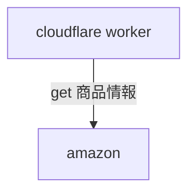
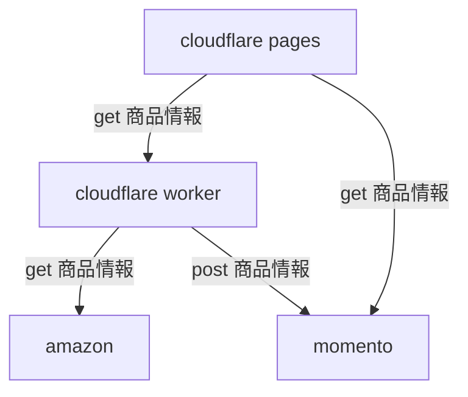

# momento cacheでスクレイピング効率を向上するを導入してみて高速化する話

## 注意

## 外部連携のバッチを高速化する

## Momento Cache を使って Amazon PA-API 5.0の商品表示を効率化する

## やりたいこと
1. Rate Limit のあるサービスの情報をまとめて裏でキャッシュしておく
2. フロントで都度表示しないようにしたい
3. ISBN or ASIN をコンポーネント化したら、商品情報を取得する時に都度表示することになるので、ユーザーごとにキャッシュ化したい
4. Amazonの規約で、24以上、キャッシュするなって書いてあるので、揮発させたい

