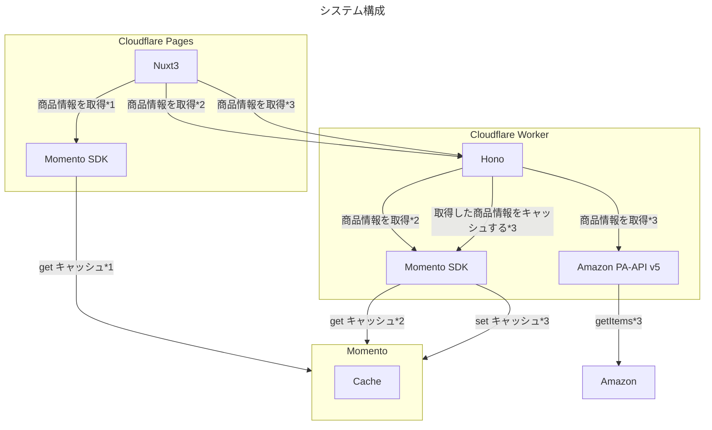

# Momento Cache + Cloudflare Worker を使って Amazon PA-API 5.0の商品表示速度を爆速にする

:::message
この記事は、Momento Advent Calendar 2023 3日目の記事です。
:::

## やりたいこと
`Momento Cache` は、`redis` や `memcached` のようなキャッシュサーバーです。
コンピューティング時間で課金されるサービスと違い、`月の無料枠＋従量課金`があって、スモールスタートなどとても使いやすいです。個人的に今まで使ってこなかった発想でキャッシュを使い倒したい。

:::message
Momento は懐に優しくて、気軽に使えるので、色々トライしてみたい
:::

## Momento Cacheを使って、やりたいこと
Momento Cacheの強みが生きるのは、やはり外部連携に絡めることかなと Rate Limit があるサービスだと特に効果的なんじゃないかと思っています。
色々考えられるんですが、今回は、Amazonの商品情報を取得するサービスを例にして、Momento Cacheを使って、商品情報を取得する速度を爆速にすることを目指します。

### Why Amazon PA-API 5.0?
商品販売のサービス開発に絡むとAmazon Product Advertising API (PA-API)を使うことが多いと思います。
:::message
大体はECフレームワークやWordpress Plugin などの利用ケースが多いんじゃないでしょうか？
:::

PA-APIは、利用制限がとても強く、APIを頻繁に実行しても良いわけではないし、キャッシュポリシーなど色々制約があるため、ハードルが高いです。
特に大きいのは
- 1req/sec(TPS)
- 8640req/day(TPD)
- 最大1日のキャッシュポリシー（情報のアップデート頻度も考慮してそれ以上保持しない利用が望ましい）
- レスポンスがとても遅い(Amazon.co.jpの情報取得で us-west-2 など遠いところにリクエストを投げる必要がある)

:::message
要するにユーザーからのリクエストと連動してPA-APIは使えない。
事前取得(キャッシュ）が必要になります。
:::


#### 参考：Best Programming Practices
@[card](https://webservices.amazon.com/paapi5/documentation/best-practices.html)


### こんなシステム要件に
1. Amazonの商品情報をCloudflare Worker + Hono + PA-APIで取得する
2. PA-APIで取得した商品情報をMomento Cacheに保存する
3. Momento Cacheに保存した商品情報をNuxt3(CSR)で表示する
4. 計測用にWorker 経由で Momento Cache に保存した情報を取得する
5. Cache は AWS ap-northeast-1 にする(近いところで測定する)
6. それぞれで速度比較する



#### 注釈
- *1: Momento Cache から商品情報を取得するパターン(事前にキャッシュしておく必要がある)
- *2: Worker 経由でMomento Cache へアクセスして商品情報を取得するパターン(事前にキャッシュしておく必要がある)
- *3: Worker 経由でAmazon PA-API へアクセスして商品情報を取得するパターン。他のパターンの事前キャッシュ用としても利用する

#### Why FrontEnd Get Momento Cache
今回のような商品情報だと、キャッシュする方法は
- APIをCDN経由にしてキャッシュを利かす
- ファイル化してCDNに配置する

これぐらいだと思いますが、
TTLを細かく設定したいので、ファイル化する方法や、APIをCDN経由にしてキャッシュを利かすのはそれぞれの操作が煩雑になりがちです。

私が考えるメリットとしては下記があるかなと
1. FrontEndからのリクエストが、Momento Cache に集中するので、大体のケースでコストが削減が見込めそう
2. APIにリクエスト出すより、Momento Cache の方が処理がない分高速
3. 他ユーザーとキャッシュを共有できる

セキュリティなど、考慮することは多くなりますが、

`readonly` でフロント用のAPIキーを作成することで、フロントからのwrite ができなくできますし、
個人情報などセンシティブな情報は`FrontEnd で扱うMomento に含めなければ良い`　と思います。

上記のため、FrontEnd から Momento Cache を使うとかなり色々効果があるんじゃないかと思っています。

#### Why Not Use Cloudflare Cache?
Cloudflare Cache は、Cloudflare Worker から利用することができますが、Cloudflareの中に閉じたAPIで、
また他にもR2,KV,DO,D1など色々速度メリットのありそうなサービスは多いですが、Worker経由でしか利用できないので、
直接アクセスするMomento Cache と比べると速度のメリットは少ないかもしれません。

:::message
あくまでも今回の目線のため、Worker 内部のキャッシュとして使用するのであれば、Momentoを利用する意味合いは薄いと思います。
:::

## 作る
### 急いでいる人用
#### リポジトリ
下記リポジトリにアップしていますので、参考にしてください。
@[card](https://gitlab.com/future-techno-developers/public/paapi-moment)

#### デプロイ先
##### 表示ページ
@[card](https://paapi-momento.pages.dev/)
##### Worker
@[card](https://paapi5_worker.future-techno-developers.workers.dev/)

- PA-API は環境変数を外してありますので、ご自身でビルドして試してください。

### Cloudflare Worker構築
#### インストール
最初から作るのであれば下記を参考にしてください。
@[card](https://hono.dev/getting-started/cloudflare-workers)
https://github.com/momentohq/client-sdk-javascript/tree/main/examples/cloudflare-workers/web-sdk
@[card](https://webservices.amazon.com/paapi5/documentation/quick-start/using-sdk.html)

:::message 
その他、各SDKなどの基本的なことは割愛します。
:::

#### Hono
Hono は Hono + Cors middleware を使用しています。そのほかは特に特殊なことはしていません。

:::message
サクッと使えるので重宝します。
:::

#### Momento
キャッシュの作成方法、SDKの使用方法は公式が提供しているexampleをそのまま流用しています。

:::message
特別な手順がなく、サクッと利用できるのがありがちあです。
:::

#### PA-API
公式の提供しているSDKとサンプルは Cloudflare Worker では動きません。
:::message alert
内部で利用している`superagent` がCloudflare Worker に対応していない
:::
`Authentiacation` ヘッダ情報の作成のみ、作成すれば、そのほかはAPIリファレンスを参考に実装することは可能です。
今回は自作する方法を選択しました。
::::details Authentication ヘッダの作成方法
1. SDKのソースコードから、sigv4.js を抜き出してくる
2. createAuthorizationHeaderをコールする
```js title=paapi.ts
reqHeader["Authorization"] = createAuthorizationHeader(
   this._accessKey,
   this._secretKey,
   reqHeader,
   "POST",
   "/paapi5/getitems",
   reqBody,        
   this._region,
   "ProductAdvertisingAPI",
   timestamp,
);

```
::::
- 参考
@[card](https://gitlab.com/future-techno-developers/public/paapi-moment/paapi-5-worker/-/blob/main/src/paapi/paapi.ts?ref_type=heads)


#### 環境変数
下記の環境変数を利用しますので、それぞれ入手してください。入手方法は公式を参照してください。
PA-API のアカウントは一定の審査があり、すぐに取得することは難しいので今回は割愛しています。

```dotenv
# for PA-API v5
PAAPI_ACCESS_KEY=<アクセスキー>
PAAPI_SECRET_KEY=<シークレットキー>
PAAPI_ASSOCIATE_TAG=<アソシエーションタグ>

# for momento
# see also https://docs.momentohq.com/cache/develop/sdks/nodejs/cheat-sheet
MOMENTO_API_KEY=＜作成したキャッシュのAPIキー＞
MOMENTO_CACHE_NAME=<作成したキャッシュ名>
```
### Cloudflare Pages構築
#### インストール
最初から作るのであれば下記を参考にしてください。
@[card](https://nuxt.com/)
@[card](https://vuetifyjs.com/)
@[card](https://docs.momentohq.com/cache/develop/sdks/web)

:::message 
vuetify は商品情報の表示用に使用しています。
:::
#### 環境変数
.env に下記を追加してください。
```dotenv
# for momento
# see also https://docs.momentohq.com/cache/develop/sdks/nodejs/cheat-sheet
MOMENTO_API_KEY=＜作成したキャッシュのAPIキー＞
MOMENTO_CACHE_NAME=<作成したキャッシュ名>

# for Cloudflare Worker
WORKER_URL=<Cloudflare Worker のデプロイ先URL>

```

## 画面イメージ
テスト用に作った画面イメージです。


##### 構成要素
- 商品情報のカード
- 商品情報取得先URLを切り替えるボタン

:::message
それぞれのボタンを押すことで、情報取得元を切り替えます。
:::

## 測定
### Momento Cache からのリクエスト


- 37ms ~45ms 
- 50ms を切っているので、かなり高速

:::message alert
ただし今回のサンプルプログラムでは３つの商品情報を取得するのに、３回リクエストを投げています。
これはだいぶ遅いので、一度で取れる方法を探す必要があります。※ちょっとわからなかったです。
:::

### Worker 経由でMomento Cache へのリクエスト


- 1st リクエストが遅い（Workerのコールドスタート的なもの）
- それ以外は多少ばらつきはあるものの 70ms~154ms に治っている
- 直接見にいく場合とそれほど時間が変わらない。これはFrontEndからなのかWorkerからなのか。回数が変わらないので、ほぼ似たような速度になっていると思われる

### Worker 経由でPA-APIへのリクエスト


- 1秒近い速度。大分遅い

### 考察
1. Momento Cache はPA-APIを実行するよりだいぶ早い。これは期待通り
2. Cloudflare Worker 上とFrontEnd上でそれほど速度的な差異が見受けられない。Momento Cache の速度に律速されているので、Worker経由でのペナルティはそれほど気にならない
   - Worker だけで問題ないとも言えるし、FrontEnd が利用しても問題ないとも言える。ユースケースによって選べば良さそう
   - 速度的な差がないのであれば、FrontEnd + Momento Cache の需要もある気がする
3. 外部連携のキャッシュとして扱うのはMomento Cache はとても有用。ただしCloudflare Worker を使う場合は　Cache APIなどあるので、考慮する必要がありそう。
   - 今回はWorker の比較だが、キャッシュ操作するインスタンスのマシンパワーによってはFrontEndの方が優位になりそう。大体はコスト削減でローパワーなインスタンスを選定しているのでは？？
4. 複数データの一括取得方法がやはり知りたい。

## 今後やりたいこと
1. Momento Cache の複数データの一括取得方法
2. セキュリティの強化はどうしたら良いのか？
3. 外部連携をどうするかはもっと深堀したい。

## 最後に
Momento はCache 以外にもServerless で使える機能がどんどん拡充されてます。これからもアップデート情報には注目です。
Pub/Sub,Webhookなど期待しています。
あと、20日目の記事も書きますので、そちらもよろしくお願いします。
