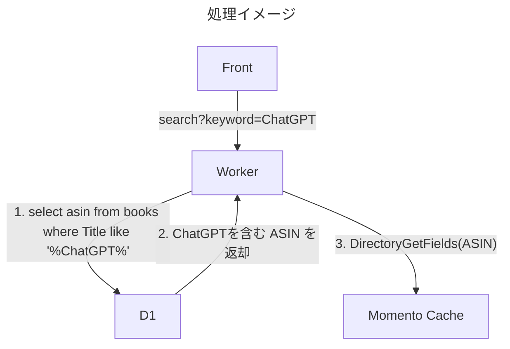

# Momento Cache + D1 を使って簡易絞り込み機能を作る

:::message
この記事は、Momento Advent Calendar 2023 7日目の記事です。
:::

@[card](https://qiita.com/advent-calendar/2023/momento)

## やりたいこと
### 前回記事
@[card](https://zenn.dev/ftd_tech_blog/articles/ftd-momento-2023-12-03)
#### この課題


- こちらは結果、DictionaryGetFields でまとめて取ることで解決しました。

##### 参考サイト
https://zenn.dev/momentobigfun/articles/7bd04650162aed
:::message
[Momento Big Fun](https://zenn.dev/momentobigfun)さんありがとうございます。
:::

## とはいえ
momento cache　はキー指定か、全部取得しかできない。絞り込みはListやスコアなどを使って、値を使った内容のフィルタはできる。
### Momentoは
- キャッシュなので一発引きするのは適している
- まとめて取る方法はあるが、絞り込みはキーを指定する必要があるので、キーを知らない場合は利用できない

**なんとか絞り込み機能をつけたい**

## どうやって？
Cloudflare には　D1がある。D1 はsqlite3 のため、SQLを使って絞り込みができる。

## システム要件
- 前回のシステムに下記を追加する。今回の内容を入れていますので、こちらを確認してください。

@[card](https://gitlab.com/future-techno-developers/public/paapi-moment/paapi-5-worker)

### バックエンド
- Cloudflare D1 キーワード登録時に、indexを作成する
- Worker でキーワードを受け取る
- 下記のクエリを投げるselect asin from books where Title like '%{input}%'
- キーのリストが取得できるので、それを使って、DictionaryGetFields でまとめて取得する



:::message
D1 を使うことで検索性能を確保する
:::

:::message alert
全部D1でいいじゃん。というのは言ってはいけない
:::

## 作る
### Cloudflare D1構築
今回はサクッと Drizzle ORM を使って構築します。

#### Drizzle のインストールはこちらで
@[card](https://orm.drizzle.team/)

#### キャッシュテーブル
```typescript:src/db/schema/books.ts
export const books = sqliteTable(
	"books",
	{
		asin: text("asin").primaryKey(),
		Title: text("Title").notNull(),
	},
	(books) => ({
		asinIdx: uniqueIndex("asinIdx").on(books.asin),
		TitleIdx: uniqueIndex("TitleIdx").on(books.Title),
	}),
);
```
#### wrangler.toml
D1 設定を追加する
```toml:config/wrangler.dev.toml
[[ d1_databases ]]
binding = "DB" # i.e. available in your Worker on env.DB
database_name = "asin"
database_id = ""
migrations_dir = "drizzle"
```

#### migrateファイル作成&migrate
```Bash
npx drizzle-kit generate:sqlite --schema=src/db/schema/books.ts --out=config/drizzle
npx wrangler d1 migrations apply asin -c config/wrangler.dev.toml
```
#### 前回のスクリプト修正
##### -e 指定をしていると D1 Bindingsがうまくできない
ここの `-e dev` を外します。これでも`.dev.vars`は読み込まれます。
```bash
wrangler dev -c config/wrangler.dev.toml -e dev
```

:::message
-e dev を入れた時に D1 Bindings を設定する良い方法があれば教えてください。
:::

### プログラム概要
#### キャッシュインデックスの作成(/momento/index/create)
すでにキャッシュされているキャッシュからインデックスを作成します。

1. Dictionary から fetch して、レコードを取得
2. ASINをキー、Titleを値として、インデックスを作成して、D1に保存します。

```typescript:src/momento/index_builder.ts
public static async build(cache: Cache, cacheDB: D1Database) {
    const values = await cache.fetch();
    const keys = [];
    for (const value of values) {
        keys.push({ asin: value[0], Title: JSON.parse(value[1]).Title });
    }
    return drizzle(cacheDB).insert(books).values(keys).onConflictDoNothing();
}
```

:::message
実際はoriginからデータを取得したタイミングで、indexを作成しても良いとは思いますが、
今回は任意のタイミングで作成できるように APIにしています。
:::


#### キャッシュインデックスのリストアップ(/momento/index)
テスト用にindexを返却します。
```json:index例
[
{
    "asin":"B0C8YJRGW8",
    "Title":"OpenAI GPT-4/ChatGPT/LangChain 人工知能プログラミング実践入門"
},
{
    "asin":"B0CBR9GYF6",
    "Title":"GitLabに学ぶ 世界最先端のリモート組織のつくりかた ドキュメントの活用でオフィスなしでも最大の成果を出すグローバル企業のしくみ"
},
{
    "asin":"B0CJRDFJZB",
    "Title":"ChatGPT/LangChainによるチャットシステム構築［実践］入門"
}]
```
#### キャッシュに登録されているTitleからの検索(/momento/search)
```Typescript:src/momento/index_builder.ts
public static async search(
    cache: Cache,
    keyword: string,
    cacheDB: D1Database,
) {
    const keys = await drizzle(cacheDB)
        .select({ asin: books.asin })
        .from(books)
        .where(like(books.Title, `%${keyword}%`));
    return cache.gets(keys.map((key) => key.asin));
}
```
##### 使い方
- Request
```bash
curl -X GET "https://paapi5_worker.future-techno-developers.workers.dev/momento/search?keyword=ChatGPT"
```
:::message
サンプルとだと ２つの書籍が取れるようになります。
:::

## 感想
1. D1とMomento Cache の組み合わせは案外相性が良い
   - D1はTransactionがなかったり、レコードが増えると重くなる傾向があるので、indexレベルの単機能で使用するのが良さそう
   - Momento Cache は検索フィルタ機能はないので、外側で戦う必要はある。Cloudflare D1と組み合わせると良さそう
4. D1 と Momento Cache のレコードの同期が課題ではあるけど、なければDictionary で取れないだけだと思うので、それほど問題ではなさそう

## 最後に
今回の機能とは少しズレますが、Momentoはシンプルな機能が多いので、完全なRedis互換だと思っていると案外できないことが多いので、 外側で色々作る必要が出てきます。
クエリキャッシュなど1:1のキャッシュの場合は良いですが、検索したり色々制御を入れたい場合は制御を作りましょう。


